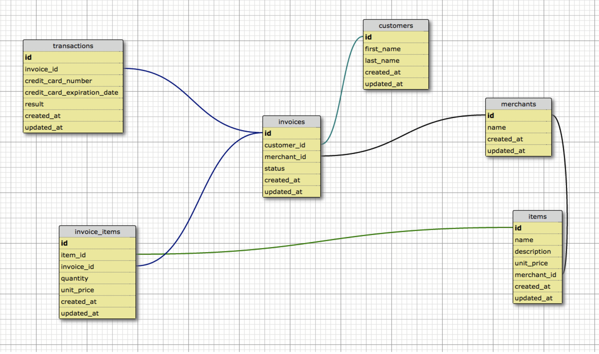

# Rails Engine
This was a project that was assigned over four days in Week 4 of Module 3 at the Turing School. The original assignment can be found [here.](https://github.com/turingschool/lesson_plans/blob/b81770c004ff6003a14428d30c8f5061fb817d73/ruby_03-professional_rails_applications/rails_engine.md) The goals of this project was to provide an API built in Rails and test an internal API. Additional features are implementation of more custom ActiveRecord queries and calculations. TDD utilized request tests implemented in RSpec.

## Installation
This repository can be cloned down and ran with:
``` bash
git clone https://github.com/erinnachen/rails_engine.git
cd rails_engine
bundle
rake db:{drop,setup}
rake import_csv:all
```

To run the server: run `rails s`
The test suite can be run with 'rspec'

## Database
The relational database has six tables:
* customers
* merchants
* invoices
* transactions
* items
* invoice items

The database can be visualized as:


## API routes
The following routes are available and are split into three categories: model endpoints, relationships and business logic.
### Endpoints
For each of the six models listed above, the following endpoints are available:
* `GET /api/v1/<pluralized_model>.json` renders a JSON representation of all the appropriate records

* `GET /api/v1/<pluralized_model>/<idnum>.json` renders a JSON representation of the singular model with the requested id

* `GET /api/v1/<pluralized_model>/random.json` returns a random object of the requested model.

* `GET /api/v1/<pluralized_model>/random.json` returns a random object of the requested model.

* `GET /api/v1/<pluralized_model>/find?id=<idnum>` returns an object of the requested model matching the query parameter (here id). All attributes of a model can be used as a query parameter.

* `GET /api/v1/<pluralized_model>/find_all?name=<name>` returns all maraches of the query parameter (here id). All attributes of a model can be used as a query parameter.

### Relationships
#### Merchants

* `GET /api/v1/merchants/:id/items` returns a collection of items associated with that merchant
* `GET /api/v1/merchants/:id/invoices` returns a collection of invoices associated with that merchant from their known orders

#### Invoices

* `GET /api/v1/invoices/:id/transactions` returns a collection of associated transactions
* `GET /api/v1/invoices/:id/invoice_items` returns a collection of associated invoice items
* `GET /api/v1/invoices/:id/items` returns a collection of associated items
* `GET /api/v1/invoices/:id/customer` returns the associated customer
* `GET /api/v1/invoices/:id/merchant` returns the associated merchant

#### Invoice Items

* `GET /api/v1/invoice_items/:id/invoice` returns the associated invoice
* `GET /api/v1/invoice_items/:id/item` returns the associated item

#### Items

* `GET /api/v1/items/:id/invoice_items` returns a collection of associated invoice items
* `GET /api/v1/items/:id/merchant` returns the associated merchant

#### Transactions

* `GET /api/v1/transactions/:id/invoice` returns the associated invoice

#### Customers

* `GET /api/v1/customers/:id/invoices` returns a collection of associated invoices
* `GET /api/v1/customers/:id/transactions` returns a collection of associated transactions

### Business Logic
#### All Merchants

* `GET /api/v1/merchants/most_revenue?quantity=x` returns the top `x` merchants ranked by total revenue
* `GET /api/v1/merchants/most_items?quantity=x` returns the top `x` merchants ranked by total number of items sold
* `GET /api/v1/merchants/revenue?date=x` returns the total revenue for date `x` across all merchants

#### Single Merchant

* `GET /api/v1/merchants/:id/revenue` returns the total revenue for that merchant across all transactions
* `GET /api/v1/merchants/:id/revenue?date=x` returns the total revenue for that merchant for a specific invoice date `x`
* `GET /api/v1/merchants/:id/favorite_customer` returns the customer who has conducted the most total number of successful transactions.
* `GET /api/v1/merchants/:id/customers_with_pending_invoices` returns a collection of customers which have pending (unpaid) invoices

#### Items

* `GET /api/v1/items/most_revenue?quantity=x` returns the top `x` items ranked by total revenue generated
* `GET /api/v1/items/most_items?quantity=x` returns the top `x` item instances ranked by total number sold
* `GET /api/v1/items/:id/best_day` returns the date with the most sales for the given item using the invoice date

#### Customers

* `GET /api/v1/customers/:id/favorite_merchant` returns a merchant where the customer has conducted the most successful transactions
